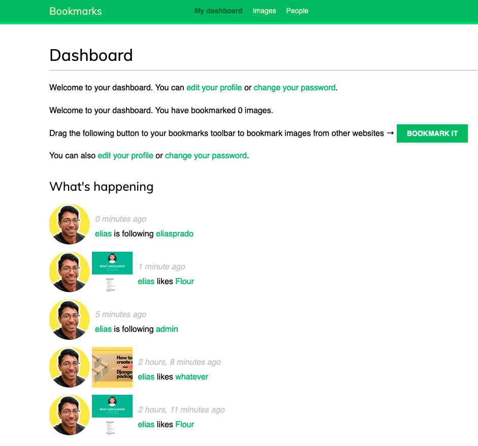
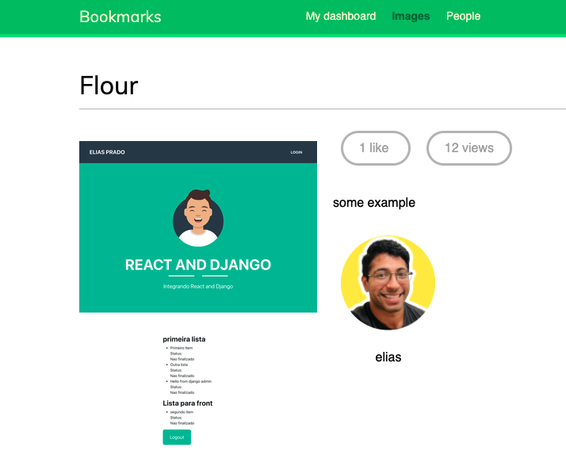
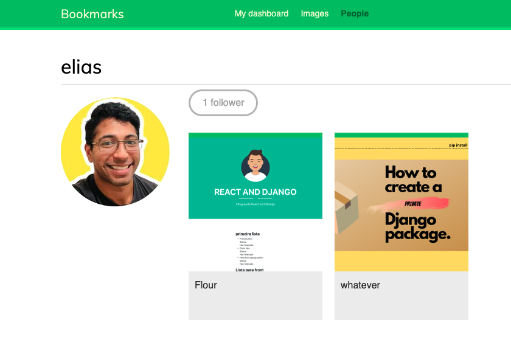
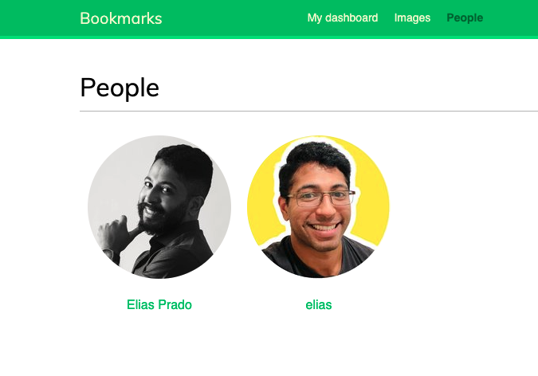
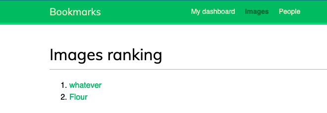

## Django Social Media.

### Dashboard:

### Followers:

### Person:

### People:

### Image Ranking:

#### Funcionalities:
- Applied an authentication system to allow users to sign up, login, edit their profiles and modify or reset passwords.
- Create a system that allow users follow each other.
- Apply a functionality to show shared pictures and implement a bookmarklet for user to share pictures from any website.
- An activity stream that allows users see the content the users they follow.

#### Technologies used:
- Django 3.0
- SQLite3
- Redis
- jQuery
- AJAX